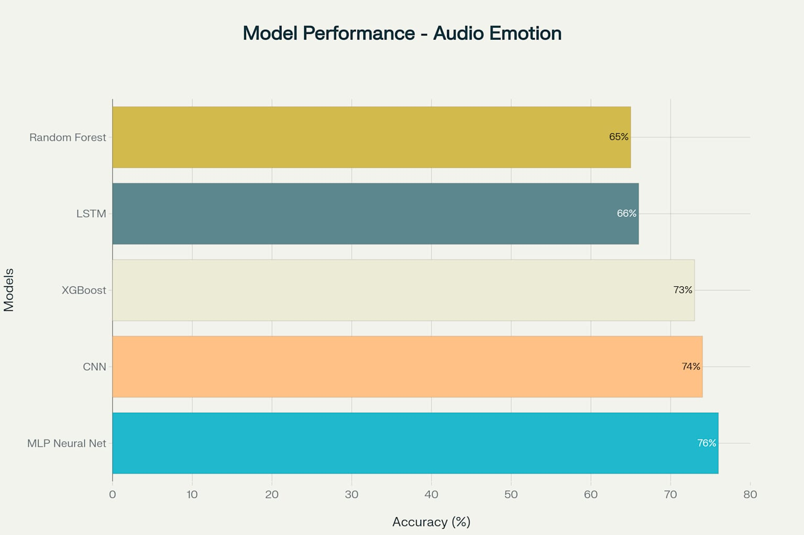
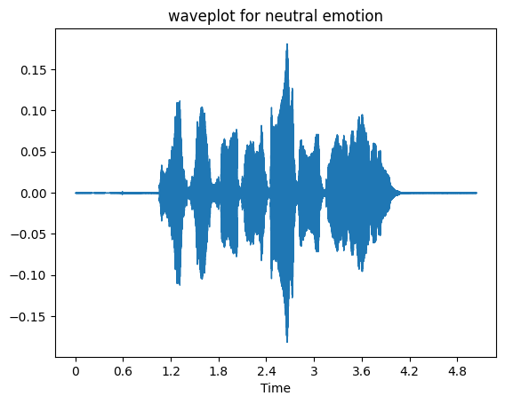
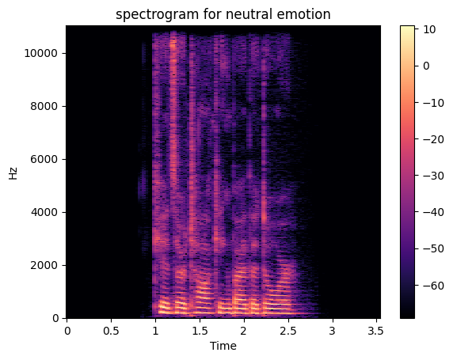

# Emotion-Classification-Speech-Processing
A comprehensive machine learning project for recognizing emotions from audio signals using the RAVDESS dataset. This project implements and compares multiple machine learning algorithms including Random Forest, XGBoost, MLP Neural Networks, CNN, and LSTM for emotion classification from speech and song audio data.

## 🎯 Project Overview

This project focuses on Speech Emotion Recognition (SER), which aims to identify human emotions from audio signals. The system analyzes acoustic features from speech and song recordings to classify emotions into 8 categories: neutral, calm, happy, sad, angry, fear, disgust, and surprise.

## Key Features:

Multi-algorithm comparison for emotion classification

Comprehensive audio feature extraction using Librosa

Support for both speech and song emotion recognition

Data visualization with waveforms and spectrograms

## 📊 Dataset Information
RAVDESS (Ryerson Audio-Visual Database of Emotional Speech and Song)

Total Samples: 2,452 audio files

Actors: 24 professional actors (12 male, 12 female)

Emotions: 8 emotional states

0: Neutral

1: Calm

2: Happy

3: Sad

4: Angry

5: Fear

6: Disgust

7: Surprise

Modalities: Speech and Song recordings

Format: Audio-only (.wav files)

### File Naming Convention
Each filename follows the format: XX-XX-XX-XX-XX-XX-XX.wav

Modality (01=full-AV, 02=video-only, 03=audio-only)

Vocal channel (01=speech, 02=song)

Emotion (01=neutral, 02=calm, 03=happy, 04=sad, 05=angry, 06=fearful, 07=disgust, 08=surprised)

Emotional intensity (01=normal, 02=strong)

Statement (01="Kids are talking by the door", 02="Dogs are sitting by the door")

Repetition (01=1st repetition, 02=2nd repetition)

Actor (01 to 24, odd=male, even=female)

## 🔧 Installation & Dependencies
Prerequisites
Python 3.7+

Jupyter Notebook

### Required Libraries:
pip install librosa

pip install pandas

pip install numpy

pip install matplotlib

pip install seaborn

pip install scikit-learn

pip install xgboost

pip install tensorflow

pip install keras

## 🎵 Feature Extraction
The project implements comprehensive audio feature extraction using Librosa:

Features Extracted (183 total features):
MFCC (Mel-Frequency Cepstral Coefficients) - 40 coefficients

Captures spectral characteristics aligned with human auditory perception

Zero Crossing Rate (ZCR) - 1 feature

Measures the rate of sign changes in the audio signal

Mel Spectrogram - 128 features

Frequency domain representation on the mel scale

Chroma STFT - 12 features

Harmonic content representation

Spectral Centroid - 1 feature

Brightness measure of the audio

Spectral Rolloff - 1 feature

Frequency below which 85% of the energy is contained

Feature Extraction Function

    def features_extract(file_path):
    
        y, sr = librosa.load(file_path)
        
        result = np.array([])
        
        # MFCC
        mfcc = np.mean(librosa.feature.mfcc(y=y, sr=sr, n_mfcc=40).T, axis=0)
        result = np.hstack((result, mfcc))
        
        # Zero Crossing Rate
        zcr = np.mean(librosa.feature.zero_crossing_rate(y=y).T, axis=0)
        result = np.hstack((result, zcr))
        
        # Mel Spectrogram
        mel = np.mean(librosa.feature.melspectrogram(y=y, sr=sr).T, axis=0)
        result = np.hstack((result, mel))
        
        # Chroma STFT
        chroma_stft = np.mean(librosa.feature.chroma_stft(y=y, sr=sr).T, axis=0)
        result = np.hstack((result, chroma_stft))
        
        # Spectral Centroid
        speCen = np.mean(librosa.feature.spectral_centroid(y=y, sr=sr)[0])
        result = np.hstack((result, speCen))
        
        # Spectral Rolloff
        specRollOff = np.mean(librosa.feature.spectral_rolloff(y=y, sr=sr))
        result = np.hstack((result, specRollOff))
        
        return result.tolist()
    
## 🤖 Machine Learning Models
The project implements and compares 5 different machine learning and deep learning algorithms:

### 1. Random Forest Classifier
      Accuracy: 65%

      Configuration: max_depth=None

      Strengths: Robust to overfitting, handles multiple features well

### 2. XGBoost Classifier
        Accuracy: 73%

        Configuration: Default parameters

        Strengths: Gradient boosting, excellent performance

### 3. MLP Neural Network (Best Performance)
        Accuracy: 76%

        **Architecture**:

        Input Layer: 183 features

        Hidden Layer 1: 128 neurons (ReLU) + Dropout(0.1)

        Hidden Layer 2: 64 neurons (ReLU) + Dropout(0.1)

        Hidden Layer 3: 32 neurons (ReLU) + Dropout(0.1)

        Hidden Layer 4: 16 neurons (ReLU) + Dropout(0.1)

        Output Layer: 8 neurons (Softmax)

        Training: 300 epochs, batch_size=32, Adam optimizer

### 4. CNN (Convolutional Neural Network)
        Accuracy: 74%

        Architecture: Conv1D layers with MaxPooling and Dropout

        Training: 100 epochs, batch_size=32

### 5. LSTM (Long Short-Term Memory)
        Accuracy: 66%

        Architecture: LSTM layers with BatchNormalization

        Training: 80 epochs, batch_size=256

## 📈 Results Summary
| Model              | Accuracy | Precision | Recall | F1-Score |
|--------------------|----------|-----------|--------|----------|
| MLP Neural Network | 76%      | 0.77      | 0.76   | 0.76     |
| CNN                | 74%      | 0.75      | 0.74   | 0.74     |
| XGBoost            | 73%      | 0.73      | 0.73   | 0.73     |
| Random Forest      | 65%      | 0.65      | 0.65   | 0.64     |
| LSTM               | 66%      | 0.67      | 0.66   | 0.66     |

Best Model Performance (MLP):
Overall Accuracy: 76%

Best Performing Emotions: Angry (91% precision), Calm (90% precision)

Challenging Emotions: Disgust, Surprise (lower precision)

## 🔍 Key Insights
MLP Neural Networks achieved the best performance (76% accuracy) among all tested algorithms

Angry and Calm emotions are most easily distinguishable (highest precision)

Feature engineering with Librosa provides rich audio representations

Gender information can be leveraged as an additional feature

Ensemble methods like XGBoost perform well on audio features

## 🎨 Visualizations
The project includes comprehensive visualizations:

Waveform plots for each emotion

Spectrograms showing frequency content

Confusion matrices for model evaluation

Training/validation loss and accuracy curves

Feature distribution analysis

## 🔬 Technical Details
Data Preprocessing: Standard scaling applied to all features

Train/Test Split: 80/20 stratified split

Cross-validation: Used for model validation

Evaluation Metrics: Accuracy, Precision, Recall, F1-Score

Hardware Requirements: Standard CPU sufficient for training

## 📚 References
RAVDESS Dataset: Livingstone SR, Russo FA (2018) The Ryerson Audio-Visual Database of Emotional Speech and Song (RAVDESS): A dynamic, multimodal set of facial and vocal expressions in North American English. PLoS ONE 13(5): e0196391.

🙏 Acknowledgments
RAVDESS Dataset creators for providing high-quality emotional speech data

